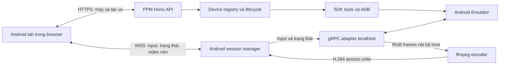

# Plan: Android Emulator trong PPM

Ngày: 2026-09-20. Trạng thái: **đề xuất triển khai, chưa viết tính năng**.
Đối chiếu repository tại `641da958`; nghiên cứu tài liệu và mã nguồn upstream ngày 2026-09-20.

## 1. Kết quả cần đạt

Người dùng mở **Android** trong PPM, chọn máy ảo, bấm Start/Open và thao tác trực tiếp: chạm, vuốt, giữ, gõ chữ, Home/Back/Recent, xoay màn hình. Mỗi máy có tab riêng; desktop có thể pop-out/PiP theo cơ chế sẵn có, điện thoại dùng giao diện cảm ứng. Emulator chạy trên máy host cài PPM; trình duyệt chỉ hiển thị và gửi thao tác.

Phạm vi mặc định: Android Emulator chính thức/AVD trên cùng host PPM; Linux trước để xác minh, Windows và macOS là các nền tảng phải kiểm chứng trước khi công bố hỗ trợ. Hai máy ảo độc lập là bài kiểm tra thiết kế; mặc định giới hạn một máy do PPM khởi động đồng thời để tránh chiếm tài nguyên host. Có thể tăng giới hạn sau kiểm tra RAM/CPU.

Không yêu cầu Android Studio đang mở. SDK, system image và AVD có thể dùng chung với Studio. Không cam kết toàn bộ tính năng của Studio: debugger, profiler, Gradle integration, camera/AR/XR và device farm nằm ngoài bản đầu. Điện thoại USB/Wi-Fi là giai đoạn mở rộng, chưa phải yêu cầu đã chốt.

## 2. Android Studio thực sự làm gì

| Bằng chứng upstream | Bài học áp dụng cho PPM |
|---|---|
| `EmulatorController.kt` kết nối localhost gRPC, gắn credentials, quản lý trạng thái và gọi các dịch vụ emulator | Backend PPM giữ kết nối native và thông tin xác thực; browser dùng API PPM. [S1] |
| `EmulatorView.kt` yêu cầu `streamScreenshot` ở định dạng `RGB888`, kích thước theo vùng hiển thị; hủy feed cũ khi thay đổi | Lấy màn hình trực tiếp từ emulator, scale theo viewport; không chụp cửa sổ desktop. [S2] |
| View chuyển chuột/phím/touch thành sự kiện emulator | Viết bộ chuyển input Android riêng; không dùng bộ inject input vào OS của Remote Desktop. [S2] |
| `emulator_controller.proto` có screenshot, input, clipboard, VM state, rotation/display metadata và timestamp | Có cơ sở xây tab tương tác; phải pin schema và probe năng lực từng phiên bản. [S3] |
| Device Manager quản lý AVD, cấu hình phần cứng và system image | Tách **danh sách máy/config** khỏi **phiên đang chạy/viewer**. [S4] |
| Tài liệu CLI minh họa Studio dùng `-qt-hide-window`, `-grpc-use-token`, `-idle-grpc-timeout` | Flags phụ thuộc phiên bản; kiểm tra `-help` trên binary thật, không copy cứng hoặc nhầm “ẩn cửa sổ” với “headless”. [S5] |

Đính chính đề xuất ban đầu: **chưa có căn cứ nói Android Studio dùng scrcpy cho embedded emulator**. Nguồn đã đọc cho thấy gRPC + screenshot feed. Scrcpy là một phương án của PPM, không phải mô tả kiến trúc Studio.

Phần khác biệt cần tự thiết kế: Studio và emulator ở cùng máy; PPM có browser qua LAN/tunnel. Một frame RGB 720×1280 cần 2,764,800 byte; 30 fps xấp xỉ 83 MB/s trước overhead. Không chuyển raw RGB qua Internet. Con số là phép tính dung lượng, không phải benchmark.

Google cũng có demo browser dùng gateway nối gRPC `rtc2` và WebRTC. Đây là hướng tham khảo riêng cho web, không đồng nghĩa embedded Studio dùng WebRTC. Proto `rtc_service_v2.proto` trên SDK máy này ghi rõ API experimental. [S6]

## 3. Bằng chứng tại máy và repository

Kiểm tra read-only, chưa boot/stop AVD và chưa thử phiên streaming:

- Emulator: `/home/thawngho/Android/Sdk/emulator/emulator`, phiên bản **36.5.10.0**, build **15081367**.
- `-list-avds`: **Pixel_9**, **Pixel_Tablet**.
- `-accel-check`: **KVM installed and usable**; chưa xác minh GPU rendering hoặc tốc độ boot.
- ADB trên PATH: `/usr/bin/adb`, **1.0.41**, package **37.0.0-android-tools**. Khi triển khai cần chọn một ADB nhất quán với SDK; không thay server ADB đang chạy chỉ vì phát hiện khác phiên bản.
- SDK có `emulator_controller.proto`, `rtc_service.proto`, `rtc_service_v2.proto`, snapshot/UI protos. Có file không chứng minh RPC hoạt động trên binary: phase 0 phải gọi thử.
- PPM có Hono/Bun WS, ffmpeg, WebCodecs viewer, tab pool và pop-out. Remote Desktop session hiện thu hồi **mọi** session khác khi mở phiên mới; không thể dùng nguyên manager này cho Android.
- TabPool giữ tab ẩn mounted. Phải ngừng feed/release input theo visibility thực tế, không chỉ cleanup khi unmount.
- Decoder Remote Desktop đang tạo timestamp theo 30 fps; chưa phải pipeline đồng bộ audio/video.
- `.claude/workflows/*`, `.ck.json` và biến `CK_PLAN_DATE_FORMAT` không có trong checkout này. Plan dùng `YYMMDD` theo tên tài liệu hiện có; áp dụng `CLAUDE.md`, roadmap, code/design standards đã có.

## 4. Quyết định kiến trúc / ADR đề xuất

### ADR-A: Backend native gRPC cho emulator

**Ưu tiên:** Bun service gọi emulator gRPC; ADB dùng discovery/boot readiness, cài APK và logcat. SDK command-line tools quản lý AVD khi tới giai đoạn quản lý máy.

> **Đính chính sau Phase 3 (2026-09-21, đo thật):** logcat **không** đi qua `adb logcat` như câu
> trên viết, mà qua gRPC `streamLogcat` — dùng lại đúng channel đã xác thực, không thêm tiến
> trình con mỗi máy, và có sẵn cả khi adb serial còn `null` lúc máy đang boot. Theo chính comment
> trong proto, `streamLogcat` chạy `logcat` trong guest qua `AdbShellStream`, nên dữ liệu là một.
> Cái mất là không đẩy được filter xuống thiết bị. **Cài APK thì vẫn đi adb** đúng như trên, vì
> `EmulatorController` không có RPC install nào. Hai phép đo đi kèm, cả hai đều trái với thứ đọc
> proto ra: `LogMessage.sort = Parsed` **không được cài đặt** và hỏng bằng cách gửi stream rỗng
> (334 message trống trong 8 s, không lỗi), còn unary `getLogcat` trả `12 UNIMPLEMENTED`. Xem
> `android-emulator-phase3-report-260921.md` §2.

Lý do: phù hợp emulator-first và học đúng ranh giới từ Studio; không cần cài server vào Android guest cho đường chính. Rủi ro: schema/auth/discovery thay đổi; thư viện gRPC Node không mặc nhiên tương thích Bun/binary compiled. Thử `@grpc/grpc-js` với protobuf client được generate/pin trước; chỉ thêm dependency sau spike. Không tự viết lại HTTP/2/gRPC, không đổi backend sang Go hay thêm Python service mặc định. [S9]

Chỉ chọn subset RPC cần dùng nhưng giữ nguồn/schema, revision và license. Không tải proto tùy ý từ mạng lúc chạy.

**Cấm `protoLoader.loadSync()`.** Nó đọc file `.proto` từ đĩa lúc chạy, và trong binary
`bun build --compile` đường dẫn trỏ vào `/$bunfs/root/` nên ném `ENOENT` — đo được ở Phase 0, đúng
bài học "compiled PPM không với tới node_modules của chính nó" trong CLAUDE.md. Đường duy nhất là
`protoLoader.fromJSON()` với descriptor JSON sinh lúc build và `import` vào module để bundler nhúng.
Đã chứng minh: binary chạy từ thư mục ngoài checkout trả `getStatus` trong 17.5 ms và pass toàn bộ
bài cancellation/deadline/cleanup y hệt bản chạy từ source. Tạo compatibility record gồm emulator version, auth mode, RPC capabilities và lỗi có hướng xử lý.

### ADR-B: Media qua WebSocket cùng origin là đường cơ sở

| Phương án | Ưu điểm | Chi phí / kết luận |
|---|---|---|
| gRPC RGB → ffmpeg H.264 → WSS → WebCodecs | Input/lifecycle giống Studio; đi cùng đường truy cập PPM | Encode thêm trên host, copy frame, xử lý resize; **phương án ưu tiên cần benchmark** |
| Native emulator WebRTC + signaling qua PPM | Browser media stack, có khả năng giảm encode trung gian | API experimental; ICE/TURN, NAT và chính sách thu hồi phiên cần kiểm chứng; để mở rộng sau |
| Scrcpy server → H.264 qua ADB → WSS | Luồng nén từ guest, dùng được cho máy thật | Client/server phải khớp phiên bản, deploy artifact vào guest; **contingency nếu gRPC media không đạt** [S7] |
| gRPC PNG → WSS → canvas | Dễ xác minh correctness, không phụ thuộc VideoDecoder | Băng thông/CPU lớn; chế độ tương thích giới hạn kích thước và fps, không dùng làm chuẩn hiệu năng |
| **gRPC MMAP side channel → ffmpeg → WSS** | Pixel không đi qua grpc-js chút nào; gRPC chỉ mang `seq`/`timestampUs` | `ImageTransport.MMAP` (`emulator_controller.proto` field 6): client sở hữu handle shm/mmap. Đo được 318/318 frame có pixel thật, **0 byte** qua gRPC. Proto tự cảnh báo *"the mmap can result in tearing"*. **Để dành**, chưa cần ở v1 |

**Quyết định (Phase 0, 2026-09-21): giữ option 1 làm đường chính.** Đo trên host Linux, emulator
36.5.10, Bun 1.3.11, `@grpc/grpc-js` 1.14.0, với chuyển động liên tục thật: RGB888 720×1600 đạt
**39.9 fps / 131.9 MiB/s**, full-res 1080×2400 đạt **40.0 fps / 297.4 MiB/s**, **không rớt frame nào**
(seq liên tục). Pipeline đầy đủ ra **360/360 frame** decode được ở **3.90 Mbit/s**. `h264_vaapi` tốn
**0.33 core** so với 64–80% của libx264. Ngưỡng 83 MB/s mà plan lo không phải là ngưỡng. Không
chuyển sang scrcpy. Chi tiết: `docs/architecture/android-emulator-phase0-report-260921.md`.

Ba chi tiết schema phải tôn trọng khi hiện thực hoá — cả ba đều đã được **đo lại ở Phase 2**, và
hai trong số đó hoá ra đoạn văn cũ ở đây ghi sai:

1. `ImageFormat.width/height` là **hộp bao giữ tỉ lệ**, không phải kích thước ra lệnh (proto:
   *"will never exceed the given width, but can be less"*). Phải xin hộp **vuông** để trần áp lên
   cạnh dài, và đọc kích thước thật từ `format.width/height` của chính frame — đó là trường
   output, và cũng là thứ khiến việc xoay màn hình chạy đúng mà không phải đoán.
2. ~~Thứ tự pixel là bottom-up nên phải có `vflip`~~ — **sai**. Câu đó chép từ comment trong
   proto. So từng hàng với `adb exec-out screencap` trên emulator 36.5.10: khớp ở mức chênh lệch
   **1.21**/pixel khi căn thẳng và **37.15** khi lật. Buffer là **top-down**; thêm `vflip` làm mọi
   màn hình lộn ngược mà không báo lỗi.
3. Sau khi một `streamScreenshot` bị cancel, mọi stream mở sau đó trả **đúng 1 frame** rồi im, kể
   cả trên channel mới. Nên đổi mức chất lượng **không được** mở lại stream: mở đúng một stream ở
   trần rung cao nhất cho cả phiên, đổi rung bằng `scale` trong ffmpeg.

Và một chi tiết input: `Touch.x/y` luôn là **pixel panel gốc chưa xoay**, không đổi theo hướng màn
hình (đo bằng `getevent`), nên toạ độ trên frame đã xoay phải được xoay ngược lại trước khi gửi.

Chỉ productize một đường chính; không xây đồng thời ba backend. Nếu raw→H.264 không đạt ngân sách, ghi ADR cập nhật rồi chuyển sang scrcpy cho video/control thay vì kết hợp input của backend này với geometry backend khác chưa được kiểm chứng.

WebSocket được Cloudflare hỗ trợ; cần heartbeat và reconnect vì kết nối có thể bị ngắt. WebRTC media đi qua tuyến ICE riêng; việc trang PPM mở được qua tunnel không chứng minh media WebRTC tới được. Không mặc định yêu cầu người dùng dựng TURN. [S6, S10]

### ADR-C: Module nội bộ độc lập, lazy-load

Đặt backend trong `src/services/android/`, UI trong `src/web/components/android/`. Dùng route/tab riêng; chỉ trích xuất tiện ích codec thực sự dùng chung. Runtime registry theo device, không tạo framework plugin mới.

Đây là bước thực dụng theo hiện trạng: extension RPC/webview hiện chưa có media/control capability đã được chứng minh. Giữ API service có ranh giới rõ để có thể chuyển thành plugin khi nền tảng hỗ trợ. Không nới quyền spawn toàn cục của extension chỉ để gọi emulator.

### ADR-D: Vòng đời emulator tách khỏi viewer

Đóng tab/refresh/mất mạng không stop emulator. Stop là hành động riêng, chỉ áp dụng máy PPM sở hữu; máy attach từ Studio mặc định chỉ Disconnect. Không kill ADB server, không kill theo tên process.

## 5. Luồng và hợp đồng nội bộ

Đồ thị là phương án ADR-B ưu tiên; thay media adapter nếu phase 0 chọn khác.

**Identity:** `avdId` dựa trên canonical AVD config path + SDK context; ID opaque cấp bởi server. `deviceId` chỉ runtime instance, đi cùng `generation`, ADB serial, PID/start identity và gRPC endpoint. Không dùng ADB serial làm ID tab bền vững. Restart máy làm runtime identity thay đổi nhưng vẫn mở lại đúng AVD.

**State máy:** `stopped → starting → booting → ready → stopping → stopped`; lỗi boot thành `error`, ADB offline hiện riêng. **State viewer:** `disconnected → connecting → viewing/controlling → paused/reconnecting/error`. Khả năng video sẵn sàng có thể trước Android boot-complete; install APK chỉ khi guest ready.

**Discovery:** SDK path do người dùng chọn → env Android SDK phù hợp → vị trí chuẩn OS/PATH. Tôn trọng AVD home overrides — nhưng **`ANDROID_AVD_HOME` thay thế chứ không cộng dồn**: set nó thì AVD của người dùng biến mất khỏi `-list-avds`, nên PPM không được set biến này toàn cục (đo ở Phase 0). Và **không bao giờ truyền `-grpc <port>`**: `emulator -help` ghi `-grpc-use-jwt ... (default, disable with -grpc flag)`, nên ghim port cố định chính là tự hạ kênh điều khiển xuống không xác thực — luôn discovery. Thực tế gRPC đã bật sẵn không cần cờ nào (`Started GRPC server at 127.0.0.1:8554, security: Local, auth: +token`), và emulator tự cảnh báo *"Basic token auth should only be used by android-studio"*, nên PPM đi đường JWT. Đọc discovery files của emulator user hiện tại với giới hạn kích thước; xác minh PID/process identity, AVD và endpoint loopback trước sử dụng. Không giả định mọi OS/version dùng một đường dẫn `avd/running`. Credentials chỉ nằm backend. Hỗ trợ token/JWT theo phiên bản đã test, báo unsupported nếu chưa có; không hạ xuống unauthenticated khi thất bại. [S8]

**Lifecycle:** mutex theo AVD + start idempotency; refresh/chạm Start hai lần không spawn hai process. Dùng argv, deadline boot có cấu hình, log ring buffer, cancellation. Timeout cho lựa chọn Retry/Stop rõ ràng; chỉ xử lý process được task đó tạo. Kiểm tra AVD đang được Studio dùng, không xóa lock file để cưỡng ép chạy.

**PPM restart:** không tự boot máy theo restored tab. Runtime registry được dựng lại từ discovery + ownership record tối thiểu; kiểm tra PID start identity để tránh PID reuse. Encoder/viewer session kết thúc, emulator do PPM tạo được giữ chạy và nhận lại nếu runtime/process ownership còn hợp lệ. Phase 0 phải thử thực tế hành vi process group/service shutdown trên từng OS; khi chưa xác minh thì không quảng cáo giữ máy xuyên restart.

**Session:** một controller lease trên mỗi runtime device; client thứ hai bị báo đang sử dụng, có hành động Take control rõ ràng. V1 chưa cần nhiều viewer thụ động. Hai device có hai session độc lập; tuyệt đối không ngắt Remote Desktop hay máy khác. Lease đề xuất heartbeat 5 giây, expire 15 giây; server hết lease phải giải phóng input. Reconnect lấy nonce mới và không replay thao tác cũ. Server cấp capability reconnect ngắn hạn, chỉ giữ trong memory của browser, bind session/device/token generation; reconnect hợp lệ thay socket cũ nguyên tử, không đợi lease hết hạn. Take control tăng generation, hủy cả pending auth/reconnect của controller cũ. Refresh mất capability thì chờ lease hoặc Take control chủ động; mục tiêu reconnect 5 giây chỉ áp dụng kết nối còn capability hợp lệ.

**API dự kiến (tên có thể điều chỉnh theo convention repository):**

| Endpoint | Contract chính |
|---|---|
| `GET /api/android/capabilities` | SDK/tool versions, host accel, streaming/backend readiness, lý do thiếu |
| `GET /api/android/devices` | AVD + runtime instance, state, ownership và capabilities; không token/đường dẫn nhạy cảm |
| `POST /api/android/avds/:avdId/start` | Validated launch profile, idempotency key → operation ID |
| `GET /api/android/operations/:id` | Pending/progress/result/error; client reconnect không khởi động lại operation |
| `POST /api/android/devices/:deviceId/stop` | Check generation và ownership, graceful stop → operation ID |
| `POST /api/android/devices/:deviceId/sessions` | Viewport/codec capabilities → session ID + nonce ngắn hạn |
| `WS /ws/android` | Auth đầu tiên, device/session binding; JSON control + binary video |
| `DELETE /api/android/sessions/:id` | Đóng viewer/idempotent, không stop máy |
| Phase 3: install/screenshot/logcat | API typed riêng, không mở generic shell/RPC proxy |
| Phase 4: AVD create/delete/wipe | Thao tác riêng, xác nhận target và hậu quả |

HTTP dùng `ok/err` hiện có. Các thao tác lâu trả operation ID, không giữ HTTP request chờ boot nhiều phút. Discovery khi Android UI hoạt động có interval/backoff giới hạn; feature chưa dùng không spawn/poll liên tục.

**WS envelope phiên bản 1:** auth, ready, geometry, input, input-reset, quality, visibility, heartbeat, error; metadata gồm session generation và geometry generation. Binary video có version, generation, sequence, timestamp/PTS, config/keyframe flag, kích thước payload. Final layout ghi trong `src/shared/android-protocol.ts` và test với fixture trước khi viết UI. Không gửi base64 video trong JSON.

**Media:** một encoder mỗi active device; RGB chỉ trong host. Giới hạn frame dimensions, message size và pending buffers. Không block Bun loop bằng encode sync. Trước encode chỉ giữ latest frame; ffmpeg rawvideo stdin không có frame header nên một khi bắt đầu write phải hoàn tất frame đó, kể cả partial write/backpressure. Chỉ drop nguyên frame chưa bắt đầu; validate stride, pixel layout và kích thước. Sau encode không drop delta tùy ý rồi tiếp tục decode: bỏ đến keyframe hợp lệ hoặc restart/request keyframe. Resize/rotation bắt đầu generation mới, gửi codec config + keyframe, bỏ late frames từ generation cũ. Duy trì timestamp monotonic từ pipeline; chưa thêm audio ở v1.

## 6. UX và input

**Device Manager:** danh sách AVD: tên, loại phone/tablet, API/ABI, trạng thái, Start/Open/Disconnect/Stop theo ownership. Empty state phân biệt chưa có SDK, thiếu emulator/system image, chưa có AVD, acceleration không dùng được. Không spinner vô thời hạn.

**Viewer:** toolbar Home, Back, Recent, Rotate, Volume, Power, Fit/100%, Disconnect; hiển thị trạng thái kết nối và lựa chọn chất lượng. Stop nằm trong menu riêng. Action chưa được backend hỗ trợ có lý do rõ ràng. Phase 3 thêm Screenshot, Install APK và Logcat ở panel phụ.

**Mobile:** viewport giữ đúng aspect ratio; nút điều khiển chính ở dưới, target ≥44×44; menu/dialog dùng bottom sheet. Có nút Keyboard và vùng nhập text dùng IME. Pinch trên màn hình Android gửi multi-touch khi bật chế độ tương tác; zoom viewer có chế độ riêng để hai hành vi không xung đột.

**Input correctness:**

- Pointer capture, ID ổn định cho nhiều ngón; down/move/up/cancel; long press và drag dựa trên thời gian thực, không lặp `adb shell input` mỗi frame.
- Ánh xạ CSS bounds/letterboxing → frame hiển thị → native display coordinates. Xét DPR, rotation, resize, display metadata. Reject input theo geometry cũ; cancel gesture khi geometry đổi.
- Pointer cancel, blur, tab hidden, mất controller, disconnect đều release keys/touches. Timeout server là lớp dự phòng cho browser mất mạng không gửi được release.
- Phân biệt physical key với text/IME (`beforeinput`, composition). **Phase 0 đo được: `sendKey.text` chỉ mang ASCII in được [32-127).** `"café"` tới nơi thành `"caf"`, còn tiếng Việt, emoji và CJK mất sạch — không lỗi, chỉ cắt cụt âm thầm. `setClipboard` giữ nguyên `"Tiếng Việt 😀"` (xác minh cả round-trip lẫn nhìn trong guest). Nên **mọi ký tự ngoài ASCII phải đi đường clipboard**, không phải `text`; đó là ràng buộc thiết kế của IME mobile ở phase 2, không phải chi tiết tối ưu.
- Clipboard là thao tác copy/paste chủ động giữa browser và guest, không bật đồng bộ clipboard OS host mặc định. Giữ nguyên giới hạn quyền clipboard của browser.
- Không chiếm shortcut PPM khi canvas không focus. PiP dùng đúng ownerDocument/window, không gắn listener cứng vào document chính.

`VideoDecoder` phụ thuộc secure context và codec thực tế. Probe `isConfigSupported`; HTTPS/localhost dùng H.264 khi có. Browser không hỗ trợ hoặc LAN HTTP có chế độ PNG tốc độ thấp, ghi nhãn chất lượng rõ ràng; nếu không đạt mức dùng được thì báo hướng mở HTTPS/trình duyệt hỗ trợ, không để màn hình đen. Backend được chọn phải chứng minh được screenshot fallback: gRPC dùng PNG, nếu chọn scrcpy thì thử ADB screenshot có giới hạn tần suất/độ phân giải; không giữ thêm toàn bộ gRPC stack chỉ để fallback. [S11]

## 7. Bảo vệ phiên và dữ liệu

Đây là yêu cầu chức năng của kênh điều khiển host/device, không phải bổ sung hệ thống phân quyền nhiều người dùng.

- Bắt buộc PPM auth enabled; validate Origin đầy đủ ở upgrade và tạo phiên, có allowlist dev proxy cụ thể. Không copy kiểm tra chỉ hostname của Remote Desktop như bảo đảm same-origin chung. **Phase 0 xác nhận câu trên đúng:** `assertSessionAllowed` trong `src/server/routes/remote-desktop.ts:28-46` so sánh **hostname, bỏ qua port**, có chủ ý và có comment — dev proxy của Vite ghi đè `Host` mà không thêm `X-Forwarded-Host`, nên so cả `host:port` sẽ chặn mọi phiên dev. Android dùng lại đúng khuôn đó, nhưng phải nhớ nó **không** phải bảo đảm same-origin đầy đủ: một trang khác **port** trên cùng hostname vẫn qua được.
- Nonce single-use TTL đề xuất 30 giây, bind auth context, device/generation, session và quyền control. Chưa auth không tạo encoder/gRPC session; auth timeout đề xuất 5 giây. PPM hiện dùng bearer token chung, không giả định đã có user/session identity phía server: logout browser phải gửi close/release, server có lease expiry dự phòng; token đổi/auth tắt thu hồi toàn bộ Android sessions.
- RPC chỉ gọi endpoint loopback server đã discovery; browser không nhập URL gRPC hay command tùy ý. Không public ADB/gRPC/TURN credentials qua API/logs.
- Bound control message size, input rate, video/encoder allocation và concurrent operations. Không nuốt key-up/cancel vì rate limiting; quá tải thì reset input.
- Cài APK nhận upload ID hoặc file qua existing path guards; xác thực đích, quota, deadline, cleanup temp qua `getPpmDir()`. Không cho upload chọn đường ghi tự do. Không tự uninstall app khi install lỗi chữ ký.
- Log chỉ metadata/errors, phiên bản, latency/bytes/drop counts; không lưu màn hình, clipboard hay text gõ mặc định.
- AVD/SDK người dùng hiện có giữ vị trí native Android; dữ liệu quản lý/cache riêng PPM qua `getPpmDir()`. Tests dùng SDK/AVD home giả và `PPM_HOME` tạm.

## 8. Bản đồ thay đổi code

Tất cả đường dẫn Android dưới đây là **dự kiến tạo**, chưa tồn tại.

| Phần | Điểm tích hợp |
|---|---|
| Backend Android | `src/services/android/`: sdk-discovery, device-registry, emulator-launcher, grpc-client/auth, session-manager, input, video-pipeline, operations |
| Schema/protocol | `src/shared/android-protocol.ts`, generated/pinned protobuf dưới module Android; build-time generate, runtime không cần protoc |
| HTTP/WS | `src/server/routes/android.ts`, `src/server/ws/android.ts`; đăng ký Hono/upgrade/dispatch trong `src/server/index.ts` |
| UI | `src/web/components/android/`: manager, tab, viewport, toolbar, input hooks, setup; lazy-loaded |
| Tab registry | `src/web/stores/tab-store.ts`, `panel-utils.ts`, `components/layout/tab-pool.tsx`, `tab-content.tsx` |
| Pop-out/icon/navigation | `window-panel-persistence.ts`, `lib/tab-type-icons.ts`, nav rail/mobile drawer/command palette; dùng `tab-host` sẵn có |
| Settings | `settings-categories.ts`, `settings-section-content.tsx`, settings routes, `src/types/config.ts`, config service |
| Codec reuse | Remote Desktop H.264 decoder/SPS/NAL helpers: trích xuất phần thuần dùng chung nếu cần, giữ regression tests đường cũ |
| Packaging | `package.json`, `.npmignore`, build/release pipeline, third-party notices; kiểm tra npm và compiled binary |

SDK path/default launch limits là host config trong KV hiện có; fit/quality là preference từng browser. Chưa cần migration DB mới hoặc ấn định migration number. Chỉ lưu ownership metadata tối thiểu nếu restart reconciliation thực sự cần; không lưu secret hoặc process handle trong workspace JSON.

## 9. Các giai đoạn và điều kiện hoàn thành

### Phase 0 — Chứng minh protocol, runtime và media

- Tạo spike riêng, scratch PPM_HOME và test AVD do task tạo; không sửa Pixel_9/Pixel_Tablet của người dùng để test destructive flows.
- Pin emulator/proto/dependency versions; đọc help thực tế, kiểm chứng discovery/token hoặc JWT, `getStatus`, screenshot, touch/key/text, rotation. So sánh tọa độ bằng test app có điểm chạm hiển thị.
- Chạy gRPC dưới Bun source **và compiled PPM**, working directory ngoài checkout; chứng minh cancellation/deadline/resource cleanup.
- Đo gRPC RGB→ffmpeg→H.264→browser; PNG làm correctness baseline. Có fixture stdin slow-consumer/partial writes để xác minh frame boundary. Nếu không đạt, benchmark scrcpy candidate và screenshot fallback tương ứng; native WebRTC chỉ spike phụ khi có lý do, không làm dependency để hoàn thành v1.
- Đo trên LAN và PPM tunnel: fps khi có chuyển động, bitrate, click-to-visible p50/p95, CPU/RSS của PPM + encoder riêng và emulator riêng, ảnh hưởng chat/terminal, rotation, hide/resume.
- Output: report versions/commands/numbers, quyết định media, giới hạn browser/OS, schema/auth compatibility. **Gate:** boot/stream/control/cleanup thật và ngân sách sơ bộ đạt; chưa đạt thì sửa ADR trước phase 1.

### Phase 1 — SDK discovery và vòng đời máy

- Capabilities/setup diagnostics; list AVD/runtime, Start/Open/Stop có ownership, trạng thái và operation progress.
- Registry identity, per-AVD mutex, timeouts, stderr bounded, port/discovery races và restart reconcile.
- Gate: start đúng một máy, không double spawn; attach máy ngoài không nhận quyền stop; lỗi SDK/KVM/boot actionable; không tác động ADB/AVD khác.

### Phase 2 — Tab hiển thị và điều khiển hoàn chỉnh

- Dedicated route/WS auth + lease, media adapter đã chọn, viewport và Android input.
- Toolbar cơ bản, Unicode/IME, multi-touch, rotation, quality, pause/resume, disconnect/reconnect.
- Tích hợp tab, pop-out/PiP và mobile; fallback browser; không bật emulator khi restore workspace.
- Gate: nghiệm thu tình huống 1–9 và 11 bên dưới trên served build. Đây là bản đầu có thể dùng để thao tác máy ảo hằng ngày; tình huống 10 thuộc phase 3, tình huống 12 thuộc phase 4.

> **Đính chính sau khi người dùng thử thật (đo 2026-09-21).**
> Ba lỗi, cả ba **không sinh ra một dòng lỗi nào** ở bất kỳ tầng nào:
> 1. **Ảnh cuộn/méo từ khung thứ hai trở đi.** `FileSink.write()` của Bun nhận trọn chunk và trả
>    về một con số **không phải** "đã ghi bao nhiêu byte của chunk này". Vòng `off += n` vì thế
>    gửi lại phần đuôi nhiều lần: đo bằng `cat`, một khung 4.924.800 byte tới nơi thành
>    **28.043.840 byte (5,7×)**. Luồng rawvideo vào ffmpeg lệch vĩnh viễn — khung **đầu** vẫn
>    đúng, mọi khung sau bị vẽ cuộn. Ghi **một lần** rồi `flush()`. Test phải đo **byte tới nơi**,
>    không đếm khung: mọi bộ đếm trong pipeline đều báo đúng trong khi ffmpeg nhận gấp 5,7 lần.
> 2. **Màn hình đứng yên thì không có video.** `streamScreenshot` là *change-driven*: đo được
>    **2 khung trong 15 giây** trên một máy nằm ở launcher. Chỉ nạp ffmpeg khi có khung mới nghĩa
>    là luồng H.264 im hẳn, và người vào xem lúc đó kẹt ở "Waiting for the first frame…" cho tới
>    khi có gì đó động đậy trong guest. Phải **nạp lại khung cuối theo nhịp fps** của rung. E2E cũ
>    không thấy vì nó chạy kèm một vòng swipe liên tục.
>    Nhưng nhịp đầy đủ không miễn phí: đo trên máy đứng im, một viewer giữ ffmpeg ở **55% một
>    core** — mỗi khung rgb24 đều bị scale và hwupload lại dù không một pixel nào đổi. Lùi về 10
>    fps sau 1 giây không đổi thì còn **11,7 khung/s vào ffmpeg, 23% một core**, trong khi client
>    vẫn nhận **24,9 access unit/s**: demuxer rawvideo khai 25 fps nên CFR mặc định của ffmpeg
>    nhân bản khung để bù lại, mà khung nhân bản gần như không tốn gì — phần đắt nằm ở mỗi khung
>    *đầu vào*. Hệ quả cần biết: **tốc độ trên dây luôn là 25 fps**, không phải `fps` của rung
>    (24/30/30), và `-g = fps/2` vì thế là GOP 0,6 s chứ không phải 0,5 s. Chưa sửa — muốn đúng
>    thì phải đặt `-framerate` cho input, và đó là thay đổi ngoài phạm vi ba lỗi này.
> 3. **`avd.id` mới là danh tính, không phải `avd.name`.** File discovery có cả hai, và với mọi AVD
>    tạo bằng Android Studio chúng khác nhau: `avd.id=Pixel_9` cạnh `avd.name=Pixel 9`. Khớp theo
>    tên hiển thị thì emulator đang chạy không khớp được dòng AVD của chính nó — danh sách hiện
>    máy là "stopped" *và* mọc thêm một dòng `external:` không có geometry. Không thấy suốt 4 phase
>    vì mọi AVD dùng để test đều tên một từ, nơi hai trường trùng nhau.

### Phase 3 — Công cụ làm việc với app

- Install APK bằng picker/upload và chọn file project; progress/cancel, lỗi ABI/minSdk/chữ ký, split APK chỉ nếu có workflow rõ ràng.
- Screenshot tải về; clipboard chủ động; Logcat theo device với filter, pause/clear-view và ring buffer, không ghi vô hạn vào DB.
- Gate: install đúng target khi có hai máy; hủy upload không để temp; logs hidden ngừng subscription; không log nội dung input/clipboard.

### Phase 4 — Device Manager đầy đủ hơn

- Tạo AVD từ system image đã cài, chọn phone/tablet profile, ABI theo host, RAM/storage hợp lý. Các API typed bọc SDK tools, không nối chuỗi shell.
- **Bắt buộc ghi `hw.keyboard=yes` vào `config.ini`.** `avdmanager` mặc định `no` (Studio thì `yes`), và khi tắt thì touch gRPC vẫn chạy hoàn hảo trong khi `sendKey` trả `OK` và **không một ký tự nào tới guest** — không lỗi, không log. Đã loại trừ allowlist và `-no-window` bằng thực nghiệm ở Phase 0.
- Cold boot, quick-boot policy; quản lý snapshot là task riêng, serialize với start/stop. Wipe/Delete có xác nhận tên máy và hậu quả, chỉ khi stopped.
- Có thể cài system image qua UI sau khi hiển thị dung lượng, license và tiến trình; không tự chấp nhận SDK license hay tải nhiều GB khi mở tab. SDK tools có `sdkmanager`/`avdmanager`; tài liệu mới cũng giới thiệu Android CLI, nên probe tool có sẵn và pin đường được test. [S4, S5, S12, S13]
- Gate: tạo→boot→stop→mở lại giữ dữ liệu; wipe/delete chỉ trúng AVD đã chọn; không sửa AVD Studio đang chạy. Không cần build lại toàn bộ SDK Manager của Studio.

> **Đính chính sau Phase 4 (đo 2026-09-21, xem `android-emulator-phase4-report-260921.md`).**
> Ba điều plan không nói, và cả ba đều hỏng **im lặng**:
> 1. `ANDROID_AVD_HOME` phải trỏ vào một thư mục **có thật**. Trỏ vào thư mục không tồn tại thì
>    `avdmanager` không báo lỗi — nó quay về `~/.android/avd`, tức thư mục AVD **thật của người
>    dùng**, và ghi AVD vào đó. Giống hệt trường hợp không set biến này cho tiến trình con.
>    `createAvd` phải `mkdir -p` avdHome trước, và vẫn kiểm tra `config.ini` có hiện ra đúng chỗ.
> 2. **Wipe không được xoá `userdata.img`.** `emulator -help-disk-images` xếp nó vào nhóm ảnh
>    *khởi tạo* cùng `system.img`, và định nghĩa `-wipe-data` là *copy nội dung của userdata.img
>    vào userdata-qemu.img* — xoá nó là xoá bản gốc mà wipe cần để khôi phục.
> 3. `hardware-qemu.ini.lock` chứa pid **kết thúc bằng byte NUL** (`519772\0`). `trim()` không bỏ
>    NUL, nên `Number()` ra `NaN` và mọi emulator đang chạy đều bị đọc là "không khoá" — dòng cảnh
>    báo "đang mở trong Android Studio" chưa từng hiện kể từ Phase 1. Lấy cụm số đầu file.

### Phase 5 — Đóng gói, ổn định và phát hành

- Test source/npm/compiled ở Linux, Windows, macOS; đường dẫn có khoảng trắng/Unicode, PATH của service khác terminal, không có Android Studio, thiếu ffmpeg/tool.
- Test thực trên mobile Safari/Chrome và desktop Chromium/Firefox theo capabilities, cả mạng cục bộ/tunnel.
- Documentation setup/troubleshoot/compatibility, license notices; feature flag opt-in, lazy load; tắt flag phải cleanup session/encoder nhưng không wipe/stop emulator ngoài ý muốn.
- Gate: artifacts được serve đúng build, regression Remote Desktop/chat/terminal pass; rollback chỉ tắt tính năng, không thay schema hoặc AVD data.

Thứ tự: **0 → 1 → 2 → 3 → 4 → 5**. Việc kiểm tra packaging/mobile/security diễn ra từ phase 0–2, không để cuối mới phát hiện. Có thể release preview sau phase 2 nếu ghi rõ chưa có AVD CRUD/công cụ phase 3–4. Chưa gắn số version hay lịch ngày trước khi có benchmark và test trên OS đích.

## 10. Ngân sách hiệu năng và cách đo

Đây là **mục tiêu nghiệm thu đề xuất**, chưa phải số đo đã đạt:

| Chỉ số | Mục tiêu ban đầu |
|---|---|
| Chất lượng chuẩn | 720p-equivalent, 30 fps khi màn hình chuyển động; bitrate mục tiêu 2–6 Mbps |
| LAN input-to-visible | p95 ≤150 ms trên host/reference client đủ tài nguyên |
| Tunnel input-to-visible | p95 ≤300 ms với RTT ≤100 ms, downstream ≥10 Mbps; báo điều kiện mạng khi đo |
| Thời gian first frame | ≤3 giây từ khi emulator đã sẵn sàng, không gồm cold boot |
| Encoder backlog | ≤2 raw frames; encode/decode/network queues đều có hard cap |
| PPM + encoder overhead | Mục tiêu ≤1 CPU core bình quân, ≤250 MiB RSS tăng thêm/device ở profile chuẩn; không tính emulator |
| Idle/ẩn | Dừng feed/encoder sau grace ≤5 giây khi không còn viewer; emulator vẫn chạy |
| Reconnect | ≤5 giây sau mạng phục hồi trong test, nonce mới/keyframe mới, không input cũ |
| Soak | 60 phút có rotate/reconnect; không tăng RAM đều, không rò encoder/gRPC/touch |

Đo click-to-visible bằng test app đổi màu khi nhận touch, quay/timestamp trên cùng browser clock; không trừ trực tiếp clock host và client chưa đồng bộ. Ghi cấu hình host/GPU/guest/browser và thông số mạng. Nếu ngân sách không đạt thì hạ profile hoặc đổi media theo ADR; không gọi số mục tiêu là benchmark.

## 11. Ma trận kiểm thử và Definition of Done

Unit/contract: parser SDK/discovery và stale PID, identity, argv/path validation, protocol packet bounds, codec generation, geometry tại 0/90/180/270°, DPR/letterbox, pointer/key cancellation, IME composition, lease expiry/nonce replay.

Integration: fake SDK processes + gRPC fixture có auth, timeout và disconnect; HTTP/WS thực qua route registration; lỗi giữa lúc auth/start/rotate, start hai lần, logout, đổi token, stop nhầm generation, thiếu quyền host. Hai thiết bị chạy đồng thời không tranh session; feature không ảnh hưởng Remote Desktop.

E2E bắt buộc với emulator thật và **bundle đã build/serve trên instance riêng**:

1. SDK có sẵn → list AVD → Start → boot progress → Open có hình.
2. Tap/long press/swipe/drag; hai ngón pinch; Home/Back/Recent/Power/Volume hoạt động.
3. Gõ `Tiếng Việt`, emoji **qua đường clipboard** (Phase 0 chứng minh `sendKey.text` không mang được); ASCII qua `key`; Enter/Backspace; bàn phím mobile không gõ đôi/mất composition.
4. Rotate liên tục trong khi kéo, resize/fit/100%; chạm vẫn đúng vị trí, không stuck touch.
5. Chuyển tab ẩn/hiện, pop-out/PiP/return; không double stream hoặc mất ownership.
6. Mất mạng 30 giây rồi reconnect; input được release, không replay click; máy vẫn chạy.
7. Client thứ hai nhận thông báo đang dùng; Take control thu hồi client cũ và input cũ.
8. Hai AVD khác nhau và Remote Desktop không đá nhau; vượt limit có lỗi rõ ràng.
9. Refresh/restore workspace không boot hoặc tự giành control; emulator đã chạy có thể reconnect.
10. Install APK đúng máy; screenshot đúng khung Android; Logcat có cap/cleanup.
11. Stop máy PPM sở hữu; máy Studio chỉ Disconnect; stale PID/AVD lock không gây kill sai.
12. Wipe/Delete task-test AVD có xác nhận và đúng target; Cold boot/Quick boot không mất dữ liệu ngoài hành động wipe.

Release checklist: cold browser origin tránh cache cũ; kiểm tra hash/timestamp served bundle; full asset pipeline gồm Monaco/precompress; isolated `PPM_HOME` và port đã kiểm tra không trùng. Không stop `ppm.service` từ session này để build. Nếu suite tổng treo theo baseline đã biết, báo rõ và chạy từng file liên quan, không tuyên bố full suite pass.

## 12. Những việc cần chốt bằng thử nghiệm

- Bun gRPC + compiled binary có hoạt động ổn với auth/stream cancellation không?
- RGB→H.264 có đạt ngân sách trên Linux/Windows/macOS, hay nên chọn scrcpy media?
- Phiên bản emulator tối thiểu, flags headless/hidden, discovery layout và auth modes nào được hỗ trợ chính thức?
- Unicode/text injection thực tế của gRPC trên các guest image; cơ chế nào cần cho mobile IME?
- Process lifecycle qua PPM restart/service shutdown ở từng OS giữ emulator như thiết kế được không?
- Chọn máy Windows/macOS và thiết bị browser thật để chạy ma trận; máy hiện tại chỉ chứng minh prerequisites Linux.

Các câu hỏi này không chặn việc lập plan. Chúng là deliverable của spike/validation; không âm thầm coi giả định là chức năng đã có.

## Nguồn tham khảo

- **S1 — Studio controller (pinned revision):** https://android.googlesource.com/platform/tools/adt/idea/+/2aa920453118ffa8cd6b2996ca95e4e7187d01c2/streaming/src/com/android/tools/idea/streaming/emulator/EmulatorController.kt
- **S2 — Studio view (cùng revision; đọc raw Gitiles):** https://android.googlesource.com/platform/tools/adt/idea/+/2aa920453118ffa8cd6b2996ca95e4e7187d01c2/streaming/src/com/android/tools/idea/streaming/emulator/EmulatorView.kt
- **S3 — Emulator controller schema:** https://android.googlesource.com/platform/tools/base/+/refs/heads/mirror-goog-studio-main/emulator/proto/emulator_controller.proto ; đối chiếu file SDK cục bộ 36.5.10 ở `emulator/lib/emulator_controller.proto`.
- **S4 — Device Manager / AVD:** https://developer.android.com/studio/run/managing-avds
- **S5 — Emulator CLI:** https://developer.android.com/studio/run/emulator-commandline
- **S6 — Google browser/WebRTC demo:** https://github.com/google/android-emulator-container-scripts/blob/master/gateway/DEMO.md ; đối chiếu `emulator/lib/rtc_service_v2.proto` cục bộ, có cảnh báo experimental.
- **S7 — Scrcpy architecture/protocol:** https://github.com/Genymobile/scrcpy/blob/master/doc/develop.md
- **S8 — Emulator gRPC/authentication:** https://android.googlesource.com/platform/external/qemu/+/686efa16baf59d776cadc3f975d12570fe44bbb9/android/android-grpc/docs/
- **S9 — gRPC Node API (không phải chứng nhận Bun compatibility):** https://grpc.io/docs/languages/node/basics/
- **S10 — Cloudflare WebSocket support:** https://developers.cloudflare.com/network/websockets/
- **S11 — Browser VideoDecoder:** https://developer.mozilla.org/en-US/docs/Web/API/VideoDecoder
- **S12 — sdkmanager:** https://developer.android.com/tools/sdkmanager
- **S13 — avdmanager:** https://developer.android.com/tools/avdmanager
- **S14 — Host acceleration:** https://developer.android.com/studio/run/emulator-acceleration

Nguồn branch/master là tài liệu động, chỉ dùng để nghiên cứu. Khi triển khai phải pin revision/hash dependency và giữ notices tương ứng. Kế hoạch không sao chép nguyên implementation Studio và không bundle SDK/system images vào PPM.
